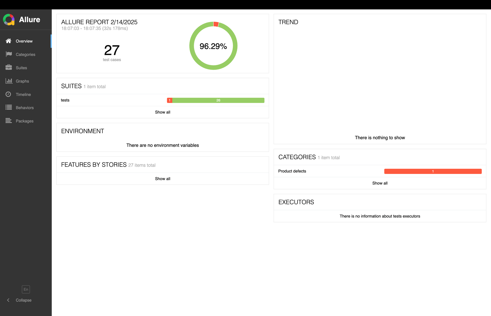
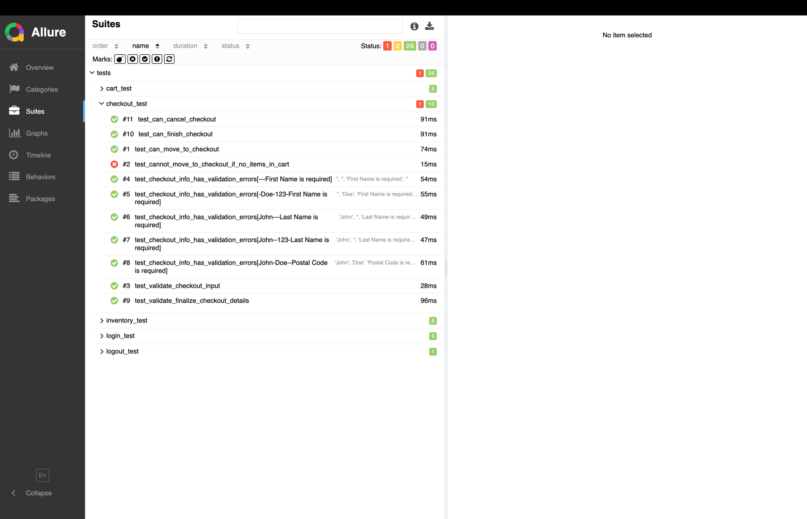
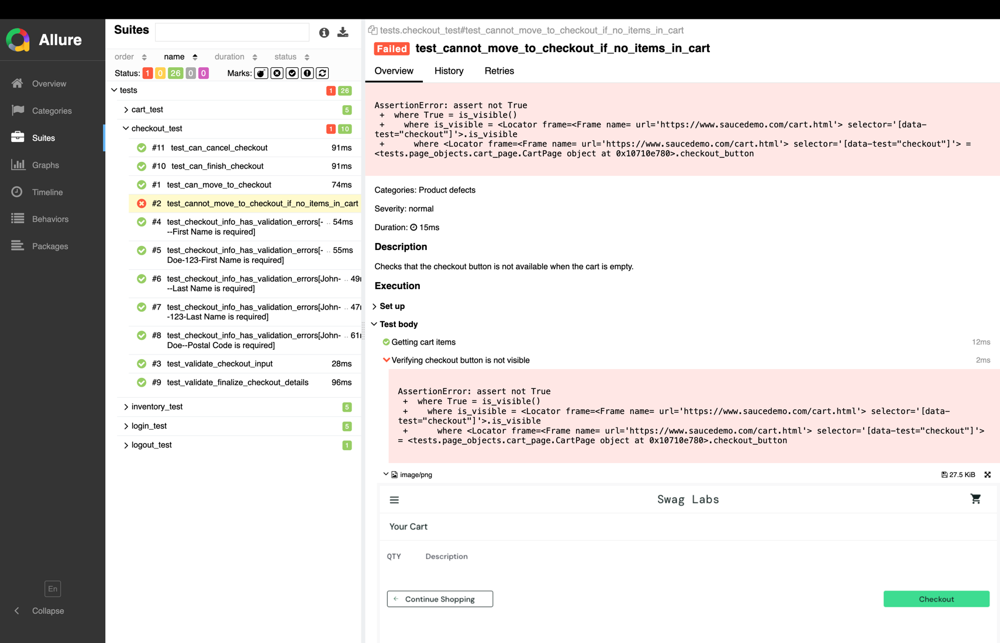

# Pytest Automation Using Playwright

This project demonstrates how to use Playwright to automate browser-based tests for `saucedemo.com`.

## Setup

```{bash}
python3 -m venv .venv
source .venv/bin/activate
pip install -r requirements.txt
```
### Installing playwright drivers 

```{bash}
  playwright install
```

### Installing allure 
MAC OS
```{bash}
  brew install allure
```

## Configuration
Create a copy of the `.env.example` file and rename it to `.env`. Fill in the required values. 

```{bash}
cp .env.example .env
```
```
HEADLESS=true
BASE_URL=https://www.saucedemo.com
USERNAME=<add-your-username> #requried for login
PASSWORD=<add-your-password> #required for login
```

## Running the tests
Run the tests with the following command:

### Running all tests

```{bash}
pytest -s -v
```

### Running a single test
To run a single test, use the `-k` flag followed by the name of the test.
```{bash}
  pytest -s -k test_add_to_cart
```

## Running test in parallel
To run the tests in parallel, use the `-n` flag followed by the number of processes you want to run. For example, to run the tests in parallel with 4 processes, use the following command:

```{bash}
pytest -s -n 4
```

## Screenshots
All screenshots are saved in the `screenshots` directory.

## Viewing the test report in Allure
After each run an allure report is generated in the `reports` directory.
to view the report run the following command:

```{bash}
allure serve reports
```

once the report is generated you can view the report at the generated url. Below 
is a sample snapshot of the dashboard.
 

You can view the individual test steps by going to suites and expanding the `tests` section


For test with failures the report contains both the reason for failure and a screenshots from the test session


>Note: for our test suite there exists one failure for a bug on the cart page where empty cart can be checked out

## Assumptions and constraints
 
- Since the cookies are short-lived for each session a new browser context is created and saved to disk and share for all test requiring auth in that session.
- We operate under the assumption that only one unit of an item can be added to the cart.


